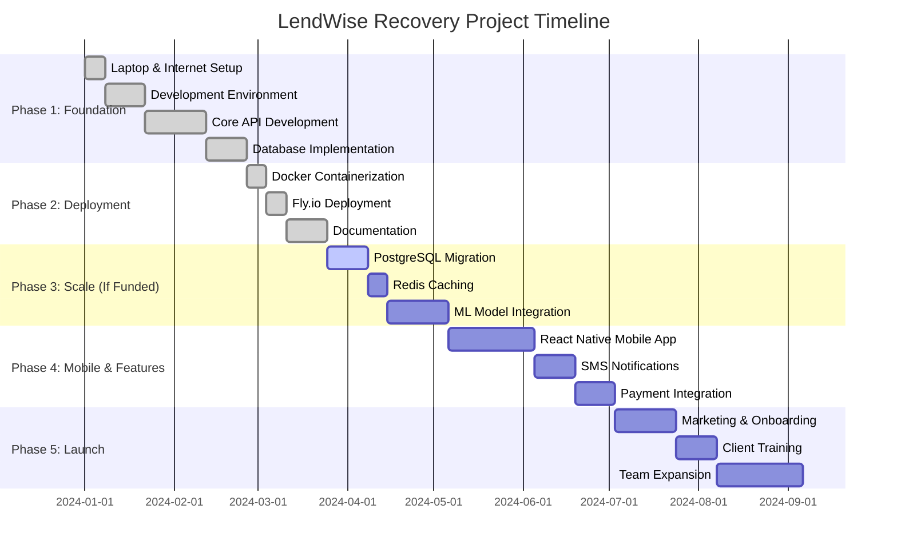

# LendWise Recovery Project Budget

The budget estimate outlines all anticipated costs for the LendWise Recovery Project development. Total estimated project cost is **22,000 KES**, leveraging open-source tools to minimize expenses.

## Cost Breakdown

| Category | Estimated Cost (KES) | Notes |
|----------|---------------------|-------|
| **Laptop and Internet** | 15,000 | Essential for development |
| **Hosting & Domain** | 5,000 | Fly.io deployment + domain |
| **Software Tools** | **0** | SQLite, Docker (open source) |
| **Miscellaneous (Stationery)** | 2,000 | Printing, notebooks, etc. |
| **Total** | **22,000 KES** | |

## What I've Covered
- Full-stack Rust/Actix-web API for loan management and AI recovery
- Authentication, role-based access, session management
- SQLite database with backup/restore
- Docker containerization and Fly.io deployment
- Comprehensive documentation (proposal, methodology, objectives)
- Live demo with real API endpoints

## Project Timeline (Gantt Chart)

> **Note:** Timeline dates are relative to project start and represent task durations, not actual calendar dates.

## Next Steps (If Funded)
1. **Scale Infrastructure**: Upgrade to PostgreSQL, add Redis caching (5,000 KES)
2. **ML Integration**: Add machine learning models for better predictions (10,000 KES)
3. **Mobile App**: React Native borrower/lender apps (30,000 KES)
4. **Advanced Features**: SMS notifications, payment integration (15,000 KES)
5. **Marketing & Onboarding**: Client acquisition, training (20,000 KES)
6. **Team Expansion**: Hire additional developers (variable)

**Total Potential Expansion Budget: 80,000+ KES**

This lean startup approach validates the concept with minimal investment while positioning for scalable growth.
