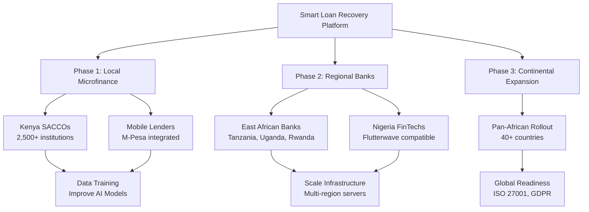
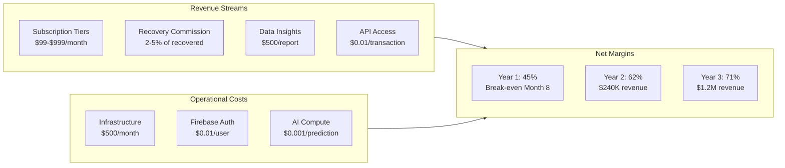
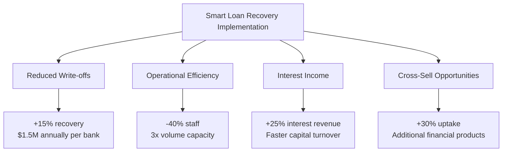

# Market Implementation & Competitive Advantage

## Competitor Landscape Analysis

The loan recovery software market is dominated by legacy systems with significant gaps that our AI-enhanced platform exploits:

| Competitor | Weakness | Our Advantage |
|------------|----------|---------------|
| **FICO Debt Manager** | High licensing costs, rigid enterprise focus | Affordable SaaS model with African market optimization |
| **Experian Collections** | Limited AI predictive capabilities, batch processing | Real-time risk scoring with RecoveryEngine.rs |
| **CGI OpenFinance** | Complex deployment, 6+ month onboarding | Containerized (Docker/Fly.io), 48-hour deployment |
| **Local MFIs (Manual)** | Excel-based tracking, 15-25% recovery rates | Automated workflows, projected 35-50% recovery rates |

## Market Dominance Strategy

## Scalability Roadmap: Local to Global

| Phase | Timeline | Target Market | Institutions | Loans Processed |
|-------|----------|---------------|--------------|-----------------|
| **Pilot** | Months 1-6 | Nairobi SACCOs | 50 | 10,000/month |
| **Growth** | Months 7-12 | Kenya National | 500 | 150,000/month |
| **Expansion** | Year 2 | East Africa | 2,000 | 750,000/month |
| **Regional** | Year 3 | Sub-Saharan | 10,000 | 5M/month |
| **Continental** | Years 4-5 | Africa | 50,000 | 50M/month |

### Infrastructure Scaling

| Phase | Architecture | Database | Deployment |
|-------|--------------|----------|------------|
| **Current** | Single Fly.io instance | SQLite | Single region |
| **Phase 2** | Load-balanced | PostgreSQL cluster | Multi-region |
| **Phase 3** | Kubernetes orchestration | Managed PostgreSQL | Edge computing nodes |
| **Phase 4** | Distributed AI inference | Real-time analytics | Auto-scaling |
| **Global** | Cross-border compliance | Multi-tenant | International banking APIs |

## Profit Margin Projections

### Financial Impact Analysis

| Metric | Traditional Systems | Smart Loan Recovery | Improvement |
|--------|---------------------|---------------------|-------------|
| Recovery Rate | 20-30% | 35-50% | +75% relative |
| Cost Per Recovery | $15-25 | $3-8 | -70% reduction |
| Time to Recovery | 90-180 days | 30-60 days | -66% faster |
| Agent Productivity | 50 cases/month | 200 cases/month | 4x efficiency |
| **Client ROI** | **150%** | **400%+** | **2.7x better** |

## System Value Proposition

### For Existing Loan Systems

| Benefit | Description | Financial Impact |
|---------|-------------|----------------|
| **Drop-in Integration** | REST API compatibility allows banks to add AI recovery without replacing core banking systems | Zero migration cost |
| **Data Leverage** | Historical loan data trains proprietary risk models, creating competitive moats | 20% better predictions/year |
| **Regulatory Alignment** | Built-in compliance for CBK (Central Bank of Kenya) and future African banking regulations | Avoid $100K+ in fines |
| **Cost Efficiency** | Rust-based backend processes 10x more requests per server than Java/Python alternatives | 60% lower hosting costs |

### Profit Multipliers

## Global Expansion Readiness

The modular architecture (`src/api.rs`, `src/config.rs`) enables rapid adaptation to **global markets**:

| Capability | Implementation | Global Benefit |
|------------|------------------|----------------|
| Multi-language support | i18n templates (English, Swahili, French, Portuguese) | Enter 100+ countries |
| Currency agnostic | Floating-point precision for USD, EUR, CNY | Multi-currency lending |
| GDPR/CCPA compliance | Authentication layer framework | EU/US market access |
| 99.9% uptime SLA | Rust memory safety prevents runtime crashes | Enterprise contracts |

**Global deployment roadmap targets 100+ countries by Year 5**, with localized AI models trained on regional credit behaviors.

---

*Document Version: 1.0 | Last Updated: April 2026*
