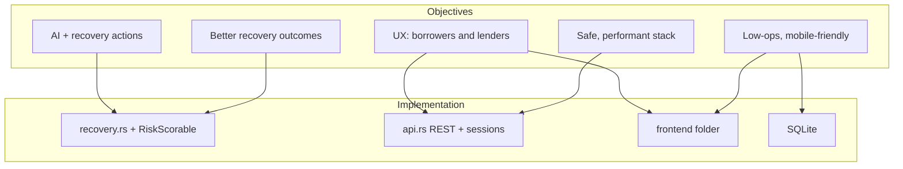

# Objectives: traceability and comparison

How the Smart Loan Recovery System’s stated goals are reflected in this repository, and how the approach differs from common alternatives. The numbered objectives match [../PROJECT_PROPOSAL.md](../PROJECT_PROPOSAL.md).

## Objectives (reference)

1. **AI-enhanced loan recovery platform** — predictive-style signals and recovery guidance.
2. **Improve recovery rates** — intelligent, escalating recovery strategies.
3. **Enhance user experience** — secure, usable flows for borrowers and lenders.
4. **African fintech challenges** — thin credit files, mobile-first usage, practical deployment.
5. **Rust excellence** — performance and safety for financial workloads.

## Main objective

The **primary** outcome is an **AI-enhanced loan recovery platform**: combine loan lifecycle data with automated **risk signals** and **recovery actions** so lenders can act earlier than in purely reactive workflows. The current codebase delivers this as a **transparent, rule-based** engine (suitable for thin credit files and audits), with room to swap in richer models later.

## How objectives are achieved in this repository

| Objective | What the system does | Where it lives |
|-----------|----------------------|----------------|
| **1. AI-enhanced platform** | Computes `risk_score` from loan state and returns a structured `recommended_action` over HTTP/CLI. | `RiskScorable` in `src/models.rs`, `RecoveryEngine` in `src/recovery.rs`, `recommend_action` in `src/api.rs`, CLI `Recommend` in `src/main.rs` |
| **2. Improve recovery rates** | Maps risk + (intended) repayment history to an escalating ladder: reminder → renegotiate → escalate. | `RecoveryEngine::recommend_action` in `src/recovery.rs`; overdue detection in `LoanTracker` / `POST /overdues` |
| **3. Enhance user experience** | Borrowers and lenders use roles, sessions, and dashboards; same flows available via REST. | `frontend/index.html`, auth and loan routes in `src/api.rs`, `UserManager` / `LoanTracker` |
| **4. African fintech challenges** | **Low ops**: embedded SQLite and Docker; **mobile-first** UI; **limited history**: rules use status and schedule rather than large proprietary datasets. | `frontend/`, `src/db.rs`, `Dockerfile`, rule logic in `src/models.rs` / `src/recovery.rs` |
| **5. Rust excellence** | Memory-safe core, async Actix Web API, typed errors and serde-backed models. | `Cargo.toml`, `src/error.rs`, `METHODOLOGY_AND_ARCHITECTURE.md` |

**Implementation note:** `repayment_history` is still stubbed in the API path (`src/api.rs`); risk scoring is status-driven in the MVP (`src/models.rs`).

## Objectives → components (diagram)

## Brief comparison with other systems

| Kind of system | Typical behavior | This project |
|----------------|------------------|--------------|
| **Traditional / manual recovery** | Works mainly **after** default; inconsistent playbooks. | **Earlier signal**: risk + status drive a **consistent** automated action suggestion. |
| **Heavy enterprise AI** | Often needs **large** history, **opaque** models, costly integration. | **Explainable rules** (auditable), **smaller** data footprint at MVP; can evolve toward ML without changing the API shape. |
| **Mobile-only reminders** | Nudges via SMS/app; little **lifecycle** or **lender** tooling. | **End-to-end** loans + roles + **recommendation** endpoint, not notifications alone. |

For deeper comparisons (similarities, differences, stakeholder framing), see **Comparison with Existing Systems** in [../PROJECT_PROPOSAL.md](../PROJECT_PROPOSAL.md). For runtime architecture and recommendation sequences, see [diagrams-mermaid.md](diagrams-mermaid.md) (Figures 1 and 4).
