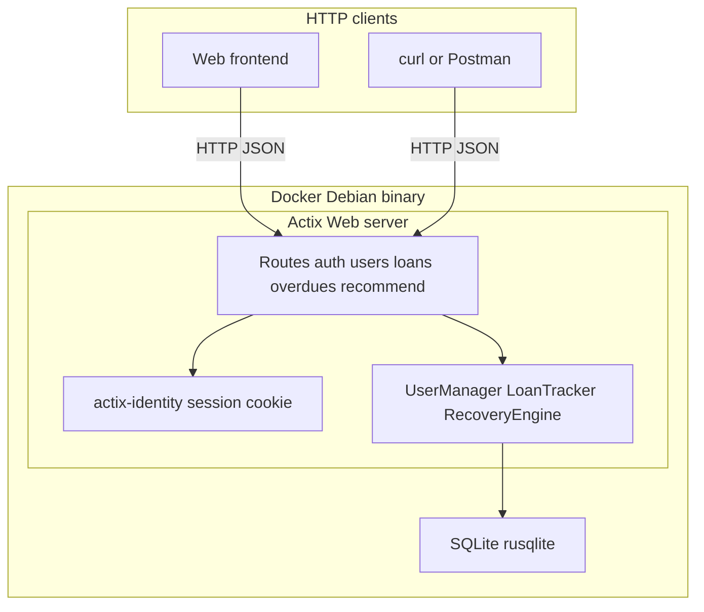
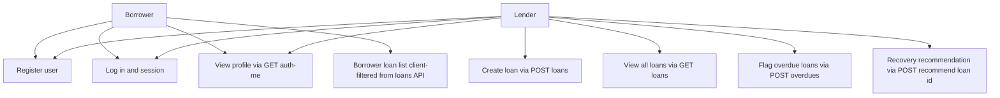
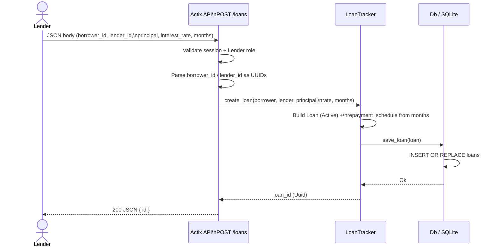
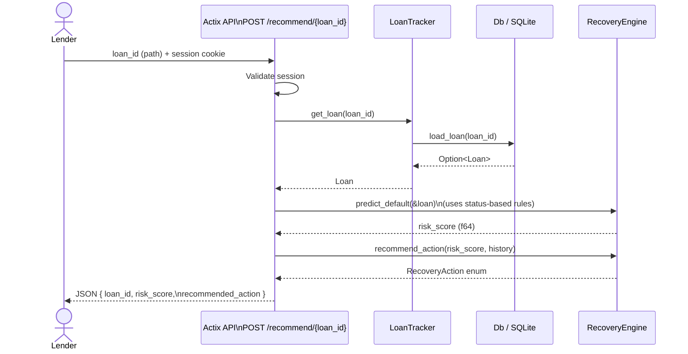
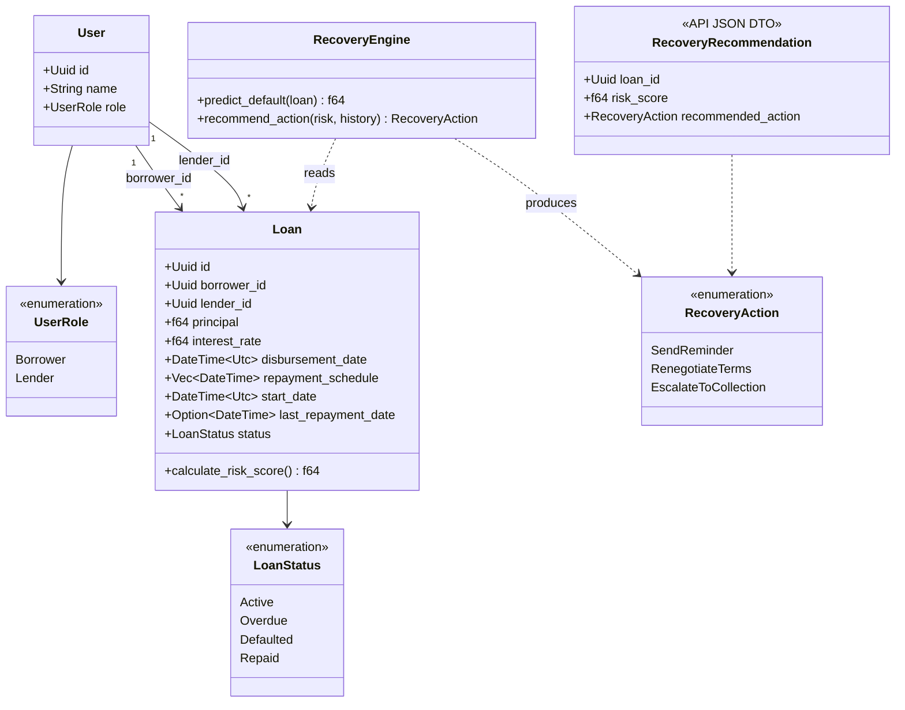
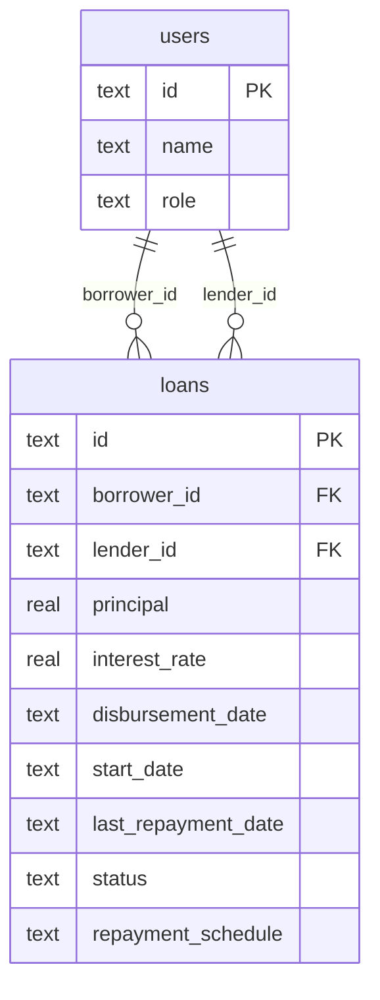
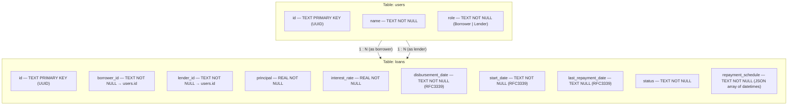
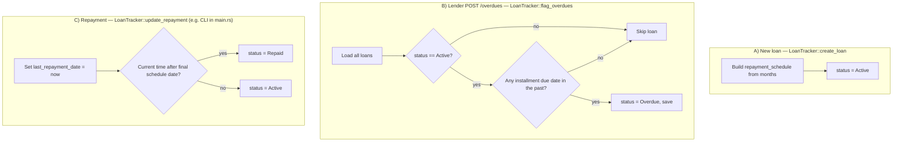
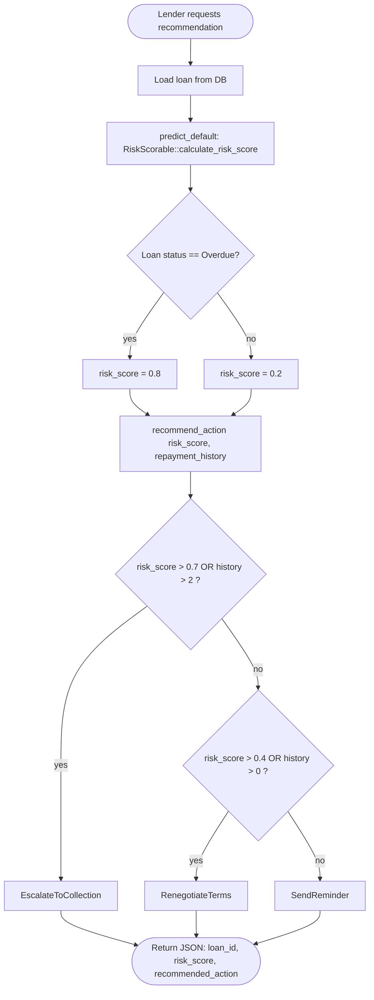
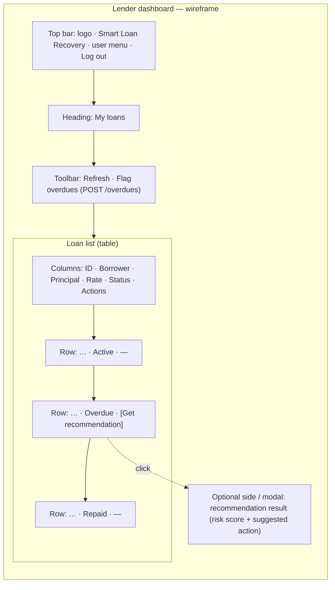

# Smart Loan Recovery — Mermaid diagrams

These diagrams match this repository: **Actix Web** API, **rusqlite** / **SQLite**, **actix-session** cookie sessions, **frontend** (and curl/Postman) as HTTP clients, and **Docker** (`Dockerfile` multi-stage build, port **3000**).

---

## Figure 1 — System architecture

---

## Figure 2 — Use case diagram

Mermaid has no standard UML use-case shape; this flowchart lists actors and use cases as rectangles. (Figure 2 revision: no percent-comment line, plain graph TB.)

---

## Figure 3 — Sequence: loan creation

Aligned with `api::create_loan` and `LoanTracker::create_loan`: lender must be authenticated with role **Lender**; loan is saved as **Active** with a **repayment schedule** derived from `months` (approx. 30-day steps).

---

## Figure 4 — Sequence: recovery recommendation

Aligned with `api::recommend_action` and `RecoveryEngine`: loads the loan, computes **risk_score** via `RiskScorable::calculate_risk_score`, then **rule-based** `recommend_action(risk_score, history)`.

---

## Figure 5 — Class diagram

Rust types from `models.rs`, `recovery.rs`, and API response shape. The API returns recommendation fields as JSON rather than a named `struct` in code.

---

## Figure 6 — Entity-relationship diagram

Logical model: `users` and `loans` in SQLite (`db.rs`). Foreign keys are conceptual (schema uses `TEXT` IDs; no `REFERENCES` clause in the current migration).

---

## Figure 7 — Database schema

Logical relationships: each loan references two users (borrower and lender). DDL is defined in `Db::init_tables` (`src/db.rs`); SQLite does not declare `FOREIGN KEY` constraints in this project.

### Column reference (SQLite)

| Table   | Column               | Type (SQLite) | Notes                                      |
|---------|----------------------|---------------|--------------------------------------------|
| `users` | `id`                 | TEXT (PK)     | UUID string                                |
| `users` | `name`               | TEXT          | NOT NULL                                   |
| `users` | `role`               | TEXT          | `Borrower` / `Lender` (debug string)       |
| `loans` | `id`                 | TEXT (PK)     | UUID string                                |
| `loans` | `borrower_id`        | TEXT          | NOT NULL, → `users.id` (logical FK)        |
| `loans` | `lender_id`          | TEXT          | NOT NULL, → `users.id` (logical FK)        |
| `loans` | `principal`          | REAL          | NOT NULL                                   |
| `loans` | `interest_rate`      | REAL          | NOT NULL (annual % in app)                 |
| `loans` | `disbursement_date`  | TEXT          | NOT NULL, RFC3339                          |
| `loans` | `start_date`         | TEXT          | NOT NULL, RFC3339                          |
| `loans` | `last_repayment_date`| TEXT          | nullable, RFC3339                          |
| `loans` | `status`             | TEXT          | Active / Overdue / Defaulted / Repaid      |
| `loans` | `repayment_schedule` | TEXT          | NOT NULL, JSON array of RFC3339 datetimes  |

---

## Figure 8 — Flowchart: loan status update process

How the codebase assigns **Active**, **Overdue**, and **Repaid**. **`Defaulted`** exists in `LoanStatus` and in the DB loader but is not set by the current automatic paths below (reserved for future rules or manual updates).

These are **three separate triggers** in the codebase (not one linear pipeline).

---

## Figure 9 — Flowchart: recovery recommendation process

Matches `RecoveryEngine` in `recovery.rs` and `POST /recommend/{loan_id}` in `api.rs`. The HTTP handler currently passes **repayment_history = 0**; the branches that depend only on `history` apply when that value is wired to real data later.

---

## Figure 10 — Mockup design (future lender dashboard)

Conceptual UI when the API is fronted by a web app: list loans, show status chips, and surface recovery for overdue rows (aligns with `frontend/index.html` direction).

**Design notes (for documentation):**

- **Status indicators**: color-coded badges (e.g. green Active, amber Overdue, grey Repaid) mapped from `LoanStatus`.
- **Get recommendation**: visible only when `status === Overdue` (or always enabled with server-side validation); calls `POST /recommend/{loan_id}` and shows `risk_score` and `recommended_action`.
- **Data**: table populated from `GET /loans` (lender view may show all loans; borrower view filters client-side by `borrower_id`).

---

## Objectives traceability (documentation)

Project goals and how they tie to code: **[OBJECTIVES_TRACEABILITY.md](OBJECTIVES_TRACEABILITY.md)**. **Figure 1** shows runtime architecture; **Figure 4** shows the recovery recommendation sequence aligned with `RecoveryEngine` and `POST /recommend/{loan_id}`.
